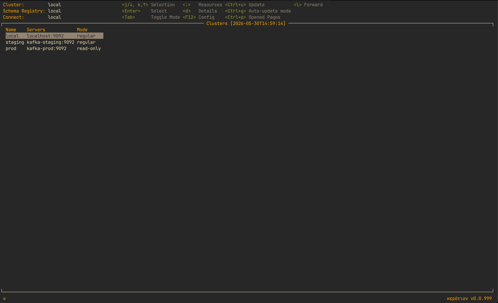

# Karat 🎯

A powerful Terminal UI (TUI) for Apache Kafka that provides an intuitive, keyboard-driven interface for managing and monitoring your Kafka clusters, topics, consumer groups, and Schema Registry.




## Table of Contents

- [Core Capabilities](#core-capabilities)
- [Available Resources](#available-resources)
- [Installation](#installation)
- [Getting Started](#getting-started)
- [Configuration](#configuration)
- [Development](#development)
- [License](#license)
- [Acknowledgments](#acknowledgments)
- [Support](#support)


## Core Capabilities

- **Multi-Cluster Management** - Connect and switch between multiple Kafka clusters seamlessly
- **Topics Management** - Browse, create, edit configs, increase partitions, and delete Kafka topics
- **Topic Producers** - View active producers and in-flight transactions per partition for a topic
- **Hide Internal Topics** - Toggle hiding of internal topics (`__*`, `*-changelog`, `*-repartition` by default) with configurable regex patterns
- **Extra Actions Menu** - Context menu (`>`) on topic pages for secondary actions like Consume, CLI commands, and Producers
- **Consumer Groups** - Monitor consumer groups, view lag and partition assignments, reset offsets, copy offsets to a new group
- **Transactions** - Browse cluster-wide Kafka transactions (transactional ID, producer ID, state, timeout, partitions)
- **ACLs** - View cluster access control lists (principal, resource, pattern type, operation, permission)
- **Schema Registry Integration** - Browse subjects, view schema versions, and inspect schemas
- **Kafka Connect Management** - View, manage, and monitor Kafka Connect connectors, including pause/resume/restart/stop actions and source connector offset management
- **Broker & Node Management** - View cluster node information and configurations
- **CLI Command Templates** - Execute external tools (kcat, kafka-console-consumer) with auto-filled parameters
- **Page History Navigation** - Forward/backward navigation through opened pages with dynamic menu keybindings
- **Inline Search & Filtering** - Fuzzy search across topics, consumer groups, subjects, connectors, transactions, and ACLs
- **Column Sorting** - Sort table views by any column with ascending/descending toggle
- **Background Columns** - Topic on-disk size and consumer-group total lag are filled in after the list renders (header shows `…` while loading); each can be switched off via `karat.features`
- **In-Memory Cache** - 5-minute TTL cache per resource; force-refresh any view with `Ctrl+U`
- **Update Notifications** - Checks GitHub for newer releases on startup and shows an update hint in the status bar


## Available Resources

Access via `:` (colon) key. Schema Registry and Connect resources appear only when configured.

| Resource | Description | Operations |
|----------|-------------|------------|
| **Clusters** | Kafka cluster management | Select, describe |
| **Schema-registries** | Schema Registry instances | Select |
| **Connect** | Kafka Connect instances | Select |
| **Nodes** | Kafka brokers | List, describe |
| **Topics** | Kafka topics | List, describe (incl. on-disk size), create, edit configs, increase partitions, delete, search, sort, hide internal topics, view producers, CLI templates, extra actions menu |
| **Consumer groups** | Consumer groups | List, describe, view lag, reset offsets, copy offsets to a new group, delete (Empty state only), find by topic, search, sort |
| **Transactions** | Cluster-wide Kafka transactions | List, describe, search, sort |
| **ACLs** | Cluster access control lists | List, search, sort |
| **Subjects** | Schema Registry subjects | List, view versions, inspect schemas, search |
| **Connectors** | Kafka Connect connectors | List, describe, pause/resume/restart/stop, delete, manage source connector offsets, search, sort |


## Installation

### Dependencies

**Required System Library:**
- `librdkafka` - Must be installed on your system
    - macOS: `brew install librdkafka`
    - Ubuntu/Debian: `apt-get install librdkafka-dev`
    - RHEL/CentOS: `yum install librdkafka-devel`


### Homebrew (macOS)

```bash
# Add the tap
brew tap uraniumdawn/karat

# Install karat
brew install karat
```

### From Source

```bash
# Clone the repository
git clone https://github.com/uraniumdawn/karat.git
cd karat

# Build
go build -o karat

# Move to your PATH
mv karat /usr/local/bin/
```

## Getting Started

### 1. Create Configuration Files

Karat requires at least one configuration file:

- `~/.config/karat/config.yaml` - Application and cluster configuration (required)
- Style file - UI color customization, path set via `karat.style` in config.yaml (optional)

### 2. Run Karat

```bash
karat
```

To check the version:

```bash
karat -version
```

## Configuration

### config.yaml

Create `~/.config/karat/config.yaml` with your Kafka cluster and Schema Registry configurations:

```yaml
karat:
  # API Configuration
  api:
    timeout: 30       # API call timeout in seconds (default: 30)
    max_concurrency: 10  # Max parallel Kafka API calls, e.g. for consumer group offset queries (default: 10)

  # Optional features (optional) — each needs extra Kafka requests; all default to true
  features:
    topic_size: true          # Topics list "Size" column + topic description actual size
    consumer_group_lag: true  # Consumer Groups list "Lag" column

  # UI Configuration (optional)
  ui:
    # Regex patterns used to classify topics as internal when hiding internal
    # topics (press "i" on the Topics page). Overrides the built-in defaults
    # (^__.*, .*-changelog$, .*-repartition$).
    internal_topic_patterns:
      - "^__.*"
      - ".*-changelog$"
      - ".*-repartition$"

  # Style file path (optional) — see examples/style/ for ready-made themes
  style: ~/.config/karat/my_style.yaml

  # Define your Kafka clusters
  clusters:
    - name: prod
      # Standard librdkafka configuration properties as documented in:
      # https://github.com/confluentinc/librdkafka/blob/master/CONFIGURATION.md
      properties:
        bootstrap.servers: kafka-prod:9094
        # Add any librdkafka properties here:
        # security.protocol: SASL_SSL
        # sasl.mechanisms: PLAIN
        # sasl.username: your-username
        # sasl.password: your-password
      selected: true  # Auto-select this cluster on startup
      # mode: read-only  # Uncomment to prevent create/edit/delete operations on this cluster

    - name: dev
      properties:
        bootstrap.servers: kafka-dev:29094
      selected: false

  # Schema Registry configurations (optional)
  schema-registries:
    - name: prod
      # Required: Schema Registry URL
      schema.registry.url: http://schema-registry-prod:8081

      # Optional: Basic authentication for Schema Registry
      # schema.registry.sasl.username: registry-user
      # schema.registry.sasl.password: registry-pass
      selected: true  # Auto-select this registry on startup

    - name: dev
      schema.registry.url: http://schema-registry-dev:8081
      selected: false

  # Kafka Connect configurations (optional)
  connect:
    - name: prod
      # Required: Kafka Connect REST API URL
      url: http://kafka-connect-prod:8083
      selected: true  # Auto-select this connect cluster on startup
      # mode: read-only  # Uncomment to prevent edit/delete/action operations on this instance

    - name: dev
      url: http://kafka-connect-dev:8083
      selected: false

  # CLI Templates for external tool integration (optional)
  # Supported placeholders:
  #   {{bootstrap}} — broker address(es) from the selected cluster
  #   {{topic}}     — name of the selected topic
  #   {{srURL}}     — Schema Registry URL from the selected registry
  cli_templates:
    # kcat example - consume from beginning with JSON formatting
    - kcat -b {{bootstrap}} -t {{topic}} -o beginning -f '{"Key":"%k","Value":%s,"Timestamp":%T,"Partition":%p,"Offset":%o,"Headers":"%h","Size":%S}\n' -u | jq .

    # kcat example - consume from end (live)
    - kcat -b {{bootstrap}} -t {{topic}}

    # kafka-console-consumer
    - kafka-console-consumer --bootstrap-server {{bootstrap}} --topic {{topic}} --from-beginning

    # Custom script example
    - ./scripts/analyze-topic.sh {{bootstrap}} {{topic}}
```

#### Important Configuration Notes

**librdkafka Properties:**
All properties in the `properties` map are passed directly to librdkafka. Karat supports:
- Connection settings (bootstrap.servers, security.protocol)
- Authentication (SASL, SSL, OAuth)
- Client configuration (request.timeout.ms, retry settings)
- Debug settings (debug: all)

**Environment Variables:**
Use `${VAR_NAME}` syntax for environment variable expansion:
```yaml
sasl.password: ${KAFKA_PASSWORD}
```

**Selected Flag:**
- Only one cluster, one schema registry, and one Kafka Connect instance should have `selected: true`
- Selection is persisted when changed via UI

**Default configuration:**
- Karat has built-in defaults for the `api`, `features`, and `ui` sections (embedded in the binary)
- Your `config.yaml` is merged on top — only the keys you specify override the defaults, and every key you leave out keeps its default
- Whatever you set is applied, including `false`, `0`, `""`, and empty lists
- Sections merge key by key: overriding `karat.features.topic_size` leaves the other feature flags at their defaults
- Lists replace the default list entirely instead of extending it
- Style files follow exactly the same rules on top of the built-in style defaults

**API settings (`api:`):**
- `timeout` — timeout in seconds for all Kafka Admin API calls (cluster describe, topic operations, consumer group queries). Default: 30
- `max_concurrency` — maximum number of parallel Kafka API calls, used when querying consumer group offsets across many groups (find-by-topic and the Consumer Groups lag column). Default: 10

**Feature settings (`features:`):**
Each flag controls a column that needs extra Kafka requests to fill. Both default to `true`; set one to `false` to hide the column, drop its `3` sort key, and stop those requests — useful on large or slow clusters. These columns are filled in the background: the header shows a trailing `…` (`Size…`, `Lag…`) while the values are still being fetched, and cells show `-` until they arrive.
- `topic_size` — Topics list `Size` column and the topic description's actual size. Default: `true`
- `consumer_group_lag` — Consumer Groups list `Lag` column, on both the Consumer Groups list and the find-by-topic view. Default: `true`

**UI settings (`ui:`):**
- `internal_topic_patterns` — list of regular expressions used to classify topics as internal when hiding internal topics (`i` on the Topics page). Replaces the built-in defaults (`^__.*`, `.*-changelog$`, `.*-repartition$`) entirely if set; set it to `[]` to treat no topic as internal.

**Read-only mode:**
- Set `mode: read-only` on a cluster or Kafka Connect instance to prevent any write operations (create, edit, delete, actions) via the UI
- Useful for protecting production environments

**Transactions, ACLs, Topic Producers, and topic size:**
- These features connect to the cluster via [franz-go](https://github.com/twmb/franz-go), built from the same `properties` as the cluster's main connection
- Supported SASL mechanisms: `PLAIN`, `SCRAM-SHA-256`, `SCRAM-SHA-512`. If the cluster's `sasl.mechanism`/`sasl.mechanisms` is unsupported, these views show a connectivity error while the rest of the UI continues to work normally

### Style

Set the path to a style file via `karat.style` in `config.yaml`:

```yaml
karat:
  style: ~/.config/karat/my_style.yaml
  clusters:
    ...
```

The style file is merged on top of the built-in defaults, so you only need to override the fields you want to change. Colors can be specified as tcell color names (`"white"`, `"grey"`) or RGB hex values (`"#1E1E1E"`). Use `"default"` to inherit your terminal's background or foreground color.

**Ready-made themes** — see [`examples/style/README.md`](examples/style/README.md) for previews and usage.

## Development

### Prerequisites

- Go 1.25 or higher
- librdkafka (for Kafka client library)
- A running Kafka cluster for testing

### Building from Source

```bash
# Clone repository
git clone https://github.com/uraniumdawn/karat.git
cd karat

# Install dependencies
go mod download

# Build (CGO_ENABLED=1 required for confluent-kafka-go)
CGO_ENABLED=1 go build -o karat

# Run
./karat
```

### Logging

All application logs are written to:
```
~/.config/karat/karat.log
```

Log format: RFC3339 timestamp with caller information (file:line)

**Log Levels:**
- `INFO` - Normal operations (startup, shutdown)
- `DEBUG` - Event handler lifecycle
- `ERROR` - Failed operations, API errors, timeouts

**Useful for debugging:**
```bash
# Watch logs in real-time
tail -f ~/.config/karat/karat.log

# Filter by level
grep ERROR ~/.config/karat/karat.log
```

## License

This project is licensed under the MIT License - see the [LICENSE](LICENSE) file for details.

## Acknowledgments

**Built with excellent open-source libraries:**

- **[tview](https://github.com/rivo/tview)** - Powerful terminal UI framework with rich widgets
- **[tcell](https://github.com/gdamore/tcell)** - Low-level terminal handling and colors
- **[confluent-kafka-go](https://github.com/confluentinc/confluent-kafka-go)** - Official Kafka Go client
- **[franz-go](https://github.com/twmb/franz-go)** - Kafka client used for transactions, ACLs, producer, and log directory queries
- **[librdkafka](https://github.com/confluentinc/librdkafka)** - High-performance C library for Kafka
- **[go-cache](https://github.com/patrickmn/go-cache)** - In-memory caching with expiration
- **[fuzzysearch](https://github.com/lithammer/fuzzysearch)** - Fuzzy string matching for search
- **[zerolog](https://github.com/rs/zerolog)** - Fast, structured logging

**Inspiration:**
- [k9s](https://github.com/derailed/k9s) - Kubernetes terminal UI
- [lazydocker](https://github.com/jesseduffield/lazydocker) - Docker terminal UI
- [Redpanda Console](https://github.com/redpanda-data/console) - Kafka web UI; inspired the topic on-disk size and connector health views


## Support

If you encounter any issues or have questions:
- [Report a Bug](https://github.com/uraniumdawn/karat/issues)
- [Request a Feature](https://github.com/uraniumdawn/karat/issues)
- Contact: sirozhaua@gmail.com

---
