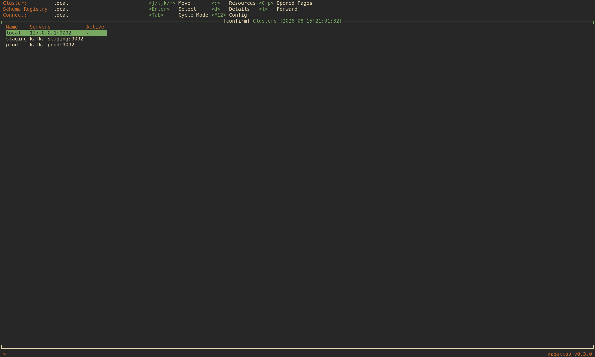
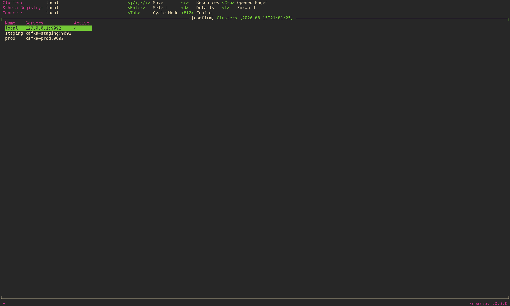
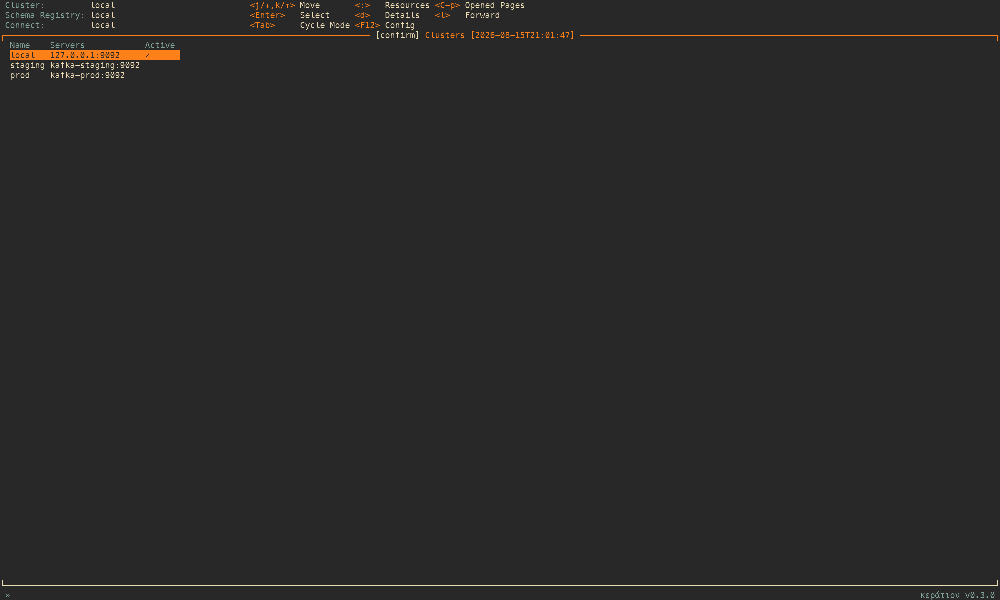
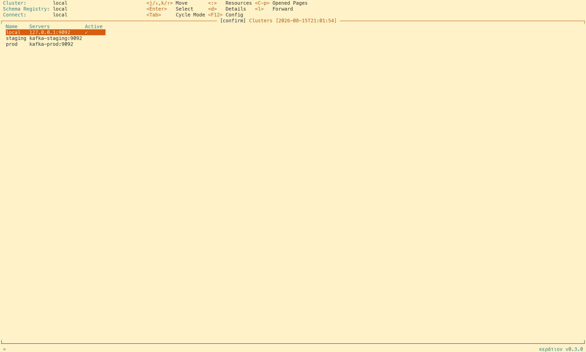
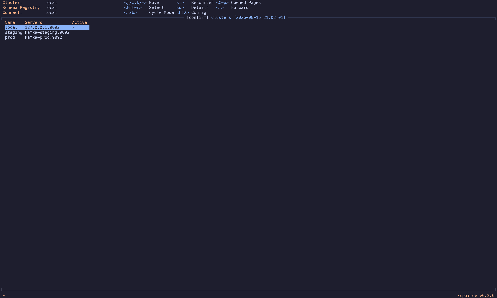
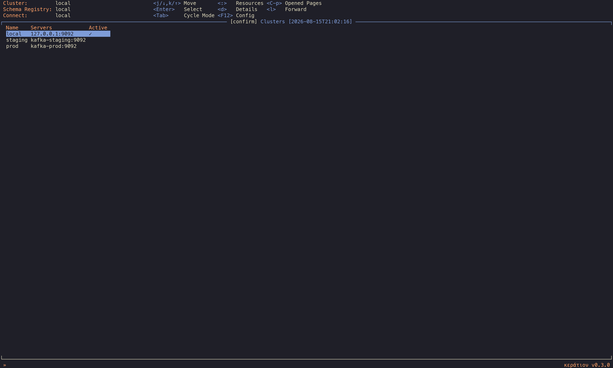

# Styles

Copy a style file to `~/.config/karat/` and name it in `karat.style`. A relative name is read
from the config directory, so the filename on its own is enough; an absolute path or one
starting with `~/` is taken as written. A style file Karat cannot read stops it at startup,
naming the path it looked at:

```yaml
karat:
  style: uranium_v3.yaml
```

Only the fields a style file sets are overridden; everything else keeps the built-in default, so
a file with two colors in it is a perfectly good style.

Each screenshot below is the Clusters page under that style: labels and column headers in the
label color, keys in the keybinding color with their descriptions beside them, the page title
and border in the title and border colors, and the selected row in the selection colors.

---

## uranium_v3

Charcoal background, orange labels and title, green keys with grey descriptions, and a cream
selection that inverts the row it lands on.


---

## uranium_v2

The same charcoal background with burnt-orange labels, and green carrying the title, border and
selection.



---

## uranium

Charcoal background with magenta labels against a bright green title, border and selection —
the loudest of the three.



---

## gruvbox_dark

Warm dark brown background, teal labels, and orange running through the keys, title, border and
selection.



---

## gruvbox_light

The same palette inverted: cream background, teal labels, and a dark orange title, border and
selection.



---

## catppuccin_mocha

Dark violet-tinted background, peach labels, and a soft blue title, border and selection.



---

## catppuccin_latte

Cool light grey background, orange labels, and a strong blue title, border and selection.


---

## kanagawa_wave

Dark blue-grey background, apricot labels, and a muted indigo title, border and selection.



---

## kanagawa_lotus

Warm parchment background, amber labels, and the same indigo title, border and selection as its
dark twin.


---

## solarized_dark

Deep teal background, rust labels, blue keys and selection, with a yellow title over a grey
border — the only style that colors those two apart.


---

## blue_accents

Near-black background, orange labels, and an electric blue title, border and selection.


